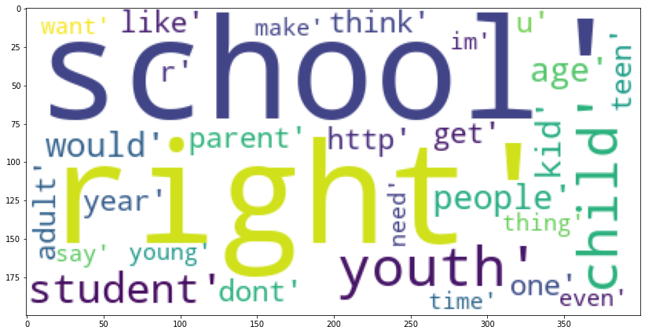
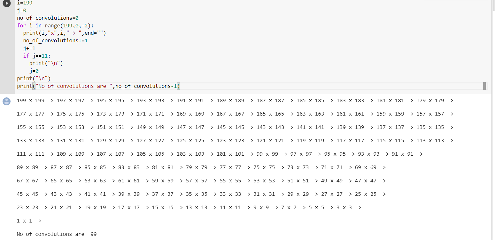
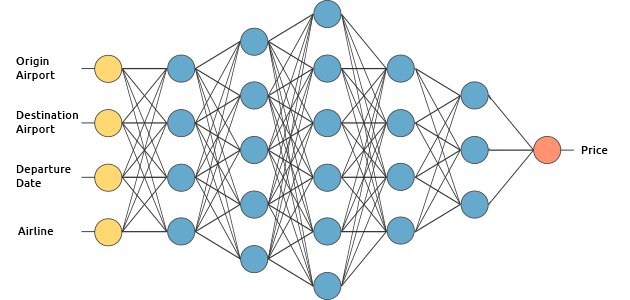

<h1 align="center">Session 0</h1>

---

### Assignment

<ul>
  <li>What are Channels and Kernels (according to EVA)?</li>
  <li>Why should we (nearly) always use 3x3 kernels?</li>
  <li>How many times to we need to perform 3x3 convolutions operations to reach close to 1x1 from 199x199</li>
  <li>How are kernels initialized? </li>
  <li>What happens during the training of a DNN?</li>
</ul>

### 1. Channels and Kernels

### Channels

We can define Channels as follows,

Lets say we have wordcloud consisting of different words as the following figure

We can be able to divide the picture in such a way that each part has only one type of letter (For example "a").Considering this we can divide the picture/wordcloud into 26(if there are no capital letters) or 52(considering capital letters) divisions and these are called as CHANNELS.Here each letter is a feature and each type of feature fits into a channel.

Note: All the similar features fits into a same channel and each different channel has a different feature in it.

For a more clear picture of understanding we can define a channel(for any case like lets consider a picture) as "A Channel consists of a certain type of feature having one or more occurences."

Now, Consider an image of a rectangle.It has two vertical and two horizantal lines.For understansing lets consider them as features.Now all the vertical lines/edges will fit into one channel and the horizontal ones into other and thus forming two channels. 

As we know the image is primarily made of RGB colors but we also know that RGB is not only the known pattern and anyset of primary colors can be considered like CMYK which is used in news papers giving 6 combinations of colours.So when we divide an image into channels all the red color will be stored in R Channel, green into G Channel and blue into B channel.This is how channels work in pictures.

We should also remember that the channel is not only limited to color of a picture.There are many features in a considered image that can be fit into a particular channel as we have discussed in the above rectangle example.

### Kernels

As we have discussed about Channels kernels can also be called as feature extractors as these are the guys that extracts all the particular features the given image has.

For a better understanding let us think about the wordcloud above.We need to extract "a".So here "a" is a feature and the feature extractor that is extracting the required feature is called as a kernel.The output after a feature extractor/kernel extracting certain feature will be a Channel"

This shows a typical scenario of convolution.The 5x5 matrix is a pixel representation of a figure where there is a 3x3 matrix convolving on top of it and thus forming a 3x3 matrix as a result of convolution.The 3x3 matrix which is convolving on it is called as a KERNEL.

This Kernel will convolute on the given image and thus forming a feature or set of features

The picture shows us how convolution happens the kernel will pass through each 3x3 matrix and therefore it performs a element wise multiplication for each corresponding values and sums it up and stores the value it on the respective output pixel

As we know that we have used 3x3 kernel to extract the features.Do we always need to use 3x3 itself ?

Lets Discuss this here

### 2. Why should we always(nearly) use 3x3 Kernel

 We need to make sure that here we are using 2D convolution(3x3) which can be elaborated as 3x3x1 for gray scale images. and while working on colored images we will be applying a 3x3 kernel on three individual channels for R,G and B.

We will refer to all the convolutions by their first two dimensions, irrespective of the channels.

A convolution filter passes over all the pixels of the image in such a manner that, at a given time, we take 'dot product' of the convolution filter and the image pixels to get one final value output. We do this hoping that the weights (or values) in the convolution filter, when multiplied with corresponding image pixels, gives us a value that best represents those image pixels. We can think of each convolution filter as extracting some kind of feature from the image.

Therefore, convolutions are done usually keeping these two things in mind -

1.Most of the features in an image are usually local. Therefore, it makes sense to take few local pixels at once and apply convolutions.

2.Most of the features may be found in more than one place in an image. This means that it makes sense to use a single kernel all over the image, hoping to extract that feature in different parts of the image.

Now the question is what is the size of the kernel to be preferred.

If we choose a kernel of larger size then it will be computationally expensive as it needs to compute larger calculation per each convolution and also the receptive field size changes and thus leads to extraction of considerably lesser features or information (as the dimension of the next layer reduces greatly) and the amount of features we procure is greater.

If we use a smaller sized kernel it will be compuationally benefitable and we will be having a larger number of layers, it learns complex, more non-linear features.But the receptive field size will be smaller when compared to the larger kernel.

Now it may lead to another question like is it good to select odd sized(2x2 , 4x4 etc..) or even sized(3x3 , 5x5 etc..) kernels?

The explanation for that is that though we may use even sized filters, odd filters are preferable because if we were to consider the final output pixel (of next layer) that was obtained by convolving on the previous layer pixels, all the previous layer pixels would be symmetrically around the output pixel. Without this symmetry, we will have to account for distortions across the layers. This will happen due to the usage of an even sized kernel. Therefore, even sized kernel filters aren’t preferred.

1X1 is eliminated from the list as the features extracted from it would be fine grained and local, with no consideration for the neighboring pixels. Hence, 3X3 works in most cases, and it often is the popular choice.

### 3. Number of convolutions needed to perform to reach 1x1 from 199x199

The no of convolutions needed to do the work are as follows.

The output shows us that the no of convolutions needed are 99(we have subtracted 1 from the no of convolutions because the program counts 199x199 as a convolution but its not.However the number will be as per our point of view.).

So 99 convolutions are needed to reach 1x1 matrix or pixel from 199x199 and the convolution will be as per the output (199x199 > 197x197 ... )

### 4. How are kernels initialized?

The question is how are the kernel values initialized.

The kernel values are initialized in such a way that it gives us the maximum value for the feature or relative feature the kernel is trying to find out in the given picture.

This can be elaborated as follows.

Lets say the kernel wants to find out a vertical edge.As we know that the pixel values for a vertical edge the kernel is trying to find will sometimes be same for some other edge/part/feature which in turn results in same output when it is convolved on them which is totally wrong as they are not same features or edges.

So to solve this problem our DNN/CNN algorithms will try different values and try to make a large difference between the output of the required feature vs some other feature that is resulting the same output when convolved.

So it is better to initialize kernel randomly than initializing them with 0's or 1's

Points to note :

1.If we initialize the weights to equal values, then the equality carries through to the gradients associated with these weights, thereby keeping the weights equal throughout the training. This is known as the Symmetry Breaking Problem, where if you start with equal initialized weights, they remain equal through the training.

2.Now we have several type of initializations like Xavier initialization ,He initialization etc which are widely used for initializing variables not only for kernel but also for activation functions.

### 5. What happens during the training of a DNN?

A deep learning model used for images/involving CNN consists of various convolution layers, with pooling layers and finally they  connected with a fully connected layer and an output layer.

It first does a forward propagation task like convolution,pooling and calculating the outputs by connected layers and finally resulting the output which inturn compared with the actual value and finding the difference between them which is called as 'loss'
and the task for reducing the loss in order to achieve a better accurate outputs is called backpropagation.

Each of the kernel is composed of weights that are updated on every pass of an image, in such a way as to reduce the final loss. These updates are made during the back propagation along the gradient, backpropagation is a method to obtain the optimal value of a function by incremental methods. Various Optimization algorithms exists such as Stochastic Gradient Descent with Momentum,RMSProp Adam Optimizer etc which make sure that we reach the optimal value with the least number of iterations(also called epochs).
This whole process is referred as Traning of a Neural Network.

This below figure is a typical example of fully connected Deep Neural Network

There are some layers in the above Neural Network which has some nodes intialized with some random values and connected fully with randomly initialized weights and the above mentioned process will be performed which is called Traning inorder to predict the output with the given input values

The difference between CNN and DNN is the convolution and pooling layers are added before the fully connected layer and the remaining process is same for the DNN and CNN.

---
### Our Team
- [Madhu Charan](https://github.com/madhucharan)
- [Sijuade](https://github.com/cydal)
- [Siddharth Aggarwal](https://github.com/aggarwalsiddharth)
- [Deepika](https://github.com/dpkeee)

---
